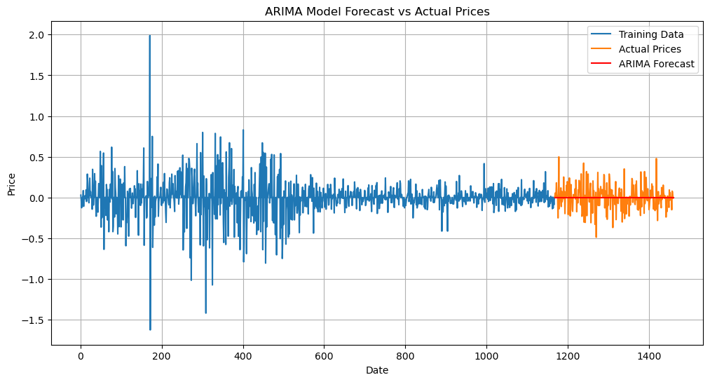
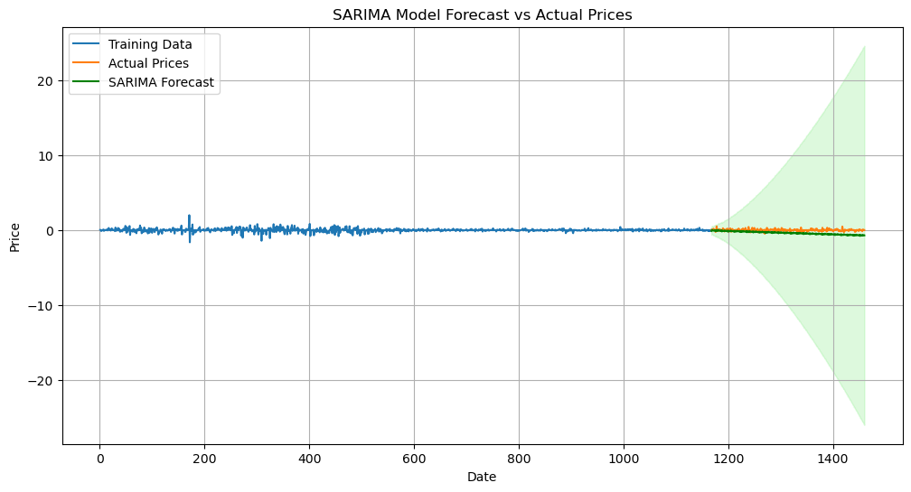
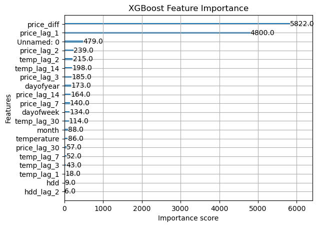
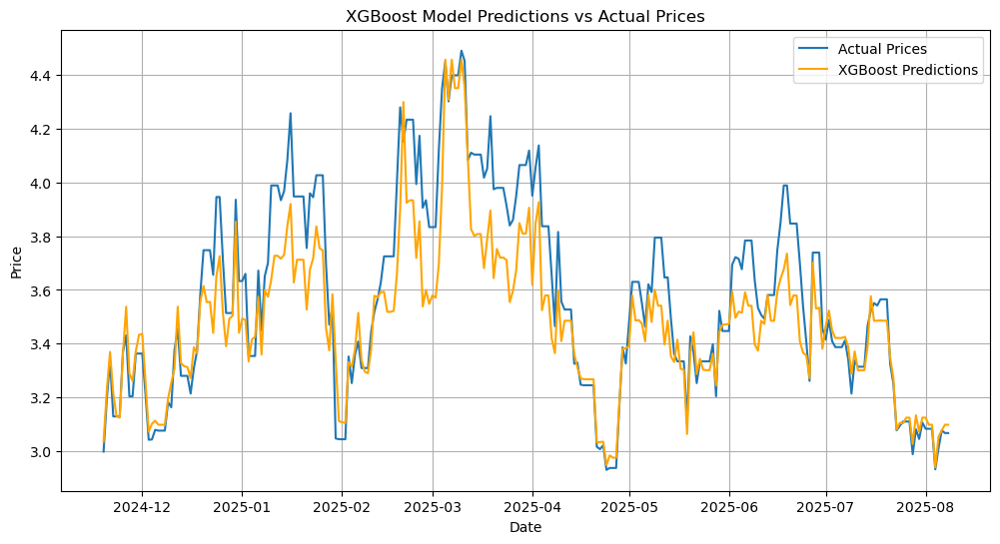

# Natural Gas Price Forecasting

## Overview
Time series forecasting project using ARIMA/SARIMA and XGBoost models to predict natural gas prices based on fundamental market data including weather patterns.

## Technologies Used
- **Python**: The core programming language used for all data analysis and model implementation
- **Jupyter Notebook**: The development environment used for conducting the analysis, visualizing results, and presenting the final models
- **Time Series Models**:
  - **ARIMA/SARIMA**: Implemented using statsmodels and pmdarima for traditional statistical forecasting
  - **XGBoost**: A machine learning model used to compare against the statistical models, demonstrating a feature-based forecasting approach
- **Data Source**:
  - **EIA API**: Used to retrieve real-world natural gas price data for the analysis

## Project Structure
- `utils/`: Python source code
- `notebooks/`: Data analysis and modeling
- `data/`: Raw and processed datasets
- `images/`: Visualizations from notebooks

## Notebooks
_[Data Preprocessing](https://github.com/bekhkamolov/natural-gas-forecasting/blob/main/notebooks/data_preprocessing.ipynb)_ notebook prepares and cleans the raw datasets for further time series modeling (ARIMA, SARIMA, XGBoost). It:

* Loads Henry Hub price data and weather data (temperature, HDD, CDD) from our created packages
* Flattens multi-index column headers
* Aligns and merges datasets on a full continuous daily date range
* Forward-fills missing price values and interpolates weather variables
* Outputs a gap-free dataset (natural_gas_data.csv) ready for modeling

Example output:

| date       | price | temperature | hdd | cdd |
| ---------- | ----- | ----------- | --- | --- |
| 2020-01-02 | 2.122 | 45.3        | 5.0 | 0.0 |
| 2020-01-03 | 2.130 | 44.8        | 6.2 | 0.0 |

## Exploratory Data Analysis (EDA)
This _[notebook](https://github.com/bekhkamolov/natural-gas-forecasting/blob/main/notebooks/exploratory_data_analysis.ipynb)_ consists of exploratory analysis using visualizations like trend plots and seasonal decomposition to understand the data's characteristics
### Data Overview
- **Henry Hub Natural Gas Prices**: Daily prices from July 2021 to July 2025
- **Temperature Data**: Daily average temperatures with clear seasonal patterns
- **Weather Variables**: Heating Degree Days (HDD) and Cooling Degree Days (CDD)

### Key Findings

**Price Series Analysis:**
- High volatility with price spike reaching ~$9.5 USD in mid-2022
- Non-stationary behavior confirmed by ADF test (p-value = 0.46)
- ACF shows slow decay typical of trending data
- PACF indicates AR(1) or AR(2) structure after differencing

**Stationarity Transformation:**
- Applied first differencing to achieve stationarity
- Post-differencing ADF test: p-value = 2.89e-26 (highly significant)
- Differenced series ready for ARIMA modeling

**Variable Relationships:**
- Weak linear correlation between price and weather variables
- Strong correlations between temperature and degree days (HDD: -0.97, CDD: 0.72)
- Suggests complex non-linear relationships may exist

**Modeling Implications:**
- First-differenced series suitable for ARIMA modeling
- PACF suggests starting with AR(1) or AR(2) models
- Weather variables available for multivariate approaches

## Model Implementations
This Jupyter notebook, _[model_implementations.ipynb](https://github.com/bekhkamolov/natural-gas-forecasting/blob/main/notebooks/model_implementations.ipynb)_ explores various time series models for forecasting natural gas prices
### Models Tested
- **ARIMA Models**: Manual configuration and random walk model based on EDA insights
- **SARIMA Models**: Automated parameter detection using pmdarima
- **XGBoost**: Time series forecasting with engineered features  
- **Model Comparison**: Performance evaluation across different approaches

### ARIMA Results
- **Model Selection**: ARIMA(0,1,0) - Random walk model
- **Rationale**: EDA showed white noise pattern after first differencing, indicating random walk behavior
- **Implementation**: Applied to stationary differenced price series
- **Performance Metrics**:
  - MSE: 0.0185
  - RMSE: 0.1360  
  - MAE: 0.0881
- **Key Findings**: Random walk model effectively captured the unpredictable nature of gas price changes

### SARIMA Analysis
- **Automated Parameter Detection**: Used `pmdarima.auto_arima()` for optimal seasonal parameter selection
- **Seasonal Decomposition**: Analyzed multiplicative seasonal patterns in original price series
- **Model Selection**: Automatic detection of best SARIMA(p,d,q)(P,D,Q,s) configuration
- **Seasonal Periods**: Algorithm tested different seasonal frequencies automatically
- **Performance Metrics**:
  - MSE: 0.1987
  - RMSE: 0.4457
  - MAE: 0.3888 
- **Results**: Compared seasonal vs non-seasonal model performance

  

### Feature Engineering (XGBoost)
- **Lag Features**: Historical price differences as predictors
- **Rolling Statistics**: Moving averages and volatility measures
- **Weather Variables**: Temperature, HDD, and CDD integration
- **Time-based Features**: Seasonal and trend components

### Model Evaluation
- **Train/Test Split**: 80-20 temporal split maintaining time series structure
- **Automated Selection**: Used statistical criteria (AIC) for model comparison
- **Performance Metrics**:
  - MSE: 0.0272
  - RMSE: 0.1648
  - MAE: 0.1232

### Key Insights
- ARIMA and SARIMA models: Initial statistical modeling confirmed that the gas price series followed a random walk pattern, with seasonal components revealed by the SARIMA model.
- Automated model selection: The use of automated tools like pmdarima.auto_arima helped in identifying optimal model parameters and reducing the risk of overfitting
- XGBoost outperformed other models: The machine learning approach using XGBoost proved to be the most effective forecasting model. Its ability to capture complex, non-linear relationships and price volatility surpassed the traditional ARIMA and SARIMA models.
- Feature engineering was crucial: The creation of lagged price and weather variables, along with time-based features, significantly improved the XGBoost model's predictive performance.
- Weather variable insights: While statistical models showed a limited linear relationship with weather variables, their inclusion in the XGBoost model demonstrated their value for capturing non-linear patterns.
